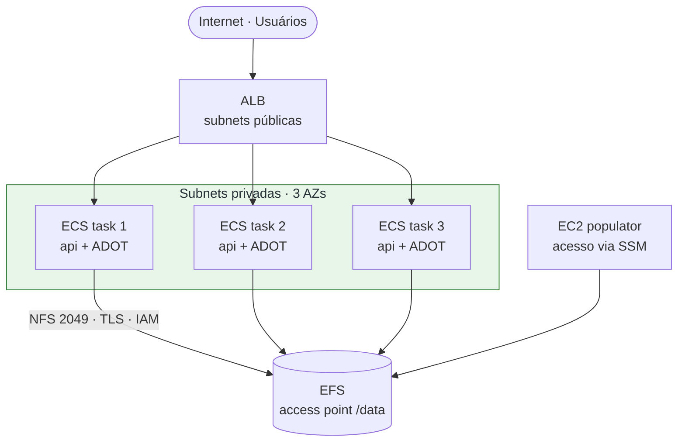

# EFS + API em ECS (Fargate)

Projeto completo: VPC → EFS → ECS (API Python) + uma EC2 "populator" que
carrega ~100 GB de dados úteis no EFS.

A infra está dividida em **9 stacks Terraform independentes** (1 bootstrap +
8 de infra), todas com state remoto S3 + lock DynamoDB.

```text
efs-api-project/
├── terraform/
│   ├── 00-backend/            # S3 state bucket + DynamoDB lock (bootstrap)
│   ├── 01-vpc/                # VPC + subnets + NAT + IGW
│   ├── 02-observability/      # S3 results bucket + log groups + dashboard + policies
│   ├── 03-efs/                # EFS + access point + ECR
│   ├── 04-ecs/                # ALB + ECS Fargate + API EFS-backed + ADOT sidecar
│   ├── 05-ec2-populator/      # EC2 Nitro que popula 100 GB no EFS
│   ├── 06-s3files/            # Bucket S3 + Gateway Endpoint
│   ├── 07-ecs-s3/             # ALB + ECS EC2 + Mountpoint for S3 + ADOT sidecar
│   ├── 08-ec2-migrator/       # EC2 com 2 mounts (EFS ro + S3) + rsync paralelo
│   ├── backend.hcl.example
│   └── write-backend-hcl.sh
├── api/                       # FastAPI - mesma imagem pros 2 clusters (STORAGE_VARIANT)
├── populator/                 # Script Python 100 GB + logs estruturados
├── migrator/                  # Helper SSM para disparar /usr/local/bin/migrate.sh
└── report/                    # Baixa JSONs do S3 e gera HTML comparativo
    └── generate_report.py
```

> **Ordem importa**: a stack `02-observability` cria as IAM managed policies
> (`bench-results-write`, `cw-emf-metrics`, `xray-write`) e o bucket de
> resultados que as stacks **04, 05, 07, 08** consomem via `data "aws_iam_policy"`
> e `data "aws_s3_bucket"`. Por isso ela vem logo após a VPC.

> **Ordem do ECR**: o ECR é criado na stack **03-efs** (não na 04-ecs). Isso
> permite buildar e fazer push da imagem **antes** de aplicar a stack 04-ecs,
> que já sobe pronta com a imagem referenciada — sem precisar de `-target`.

> **State remoto**: todas as stacks de infra (01–08) usam backend S3 com lock DynamoDB. Apenas a
> stack `00-backend` usa state local (chicken-and-egg: ela cria o próprio
> backend). Versione o `00-backend/terraform.tfstate` em local seguro.

## Arquitetura

Visão rápida da Fase 1 (ECS Fargate + EFS). Os 5 diagramas completos (3 fases +
populator + migrator) estão em [diagrams/architectures.md](diagrams/architectures.md).



**Princípios:**
- EFS acessado via **Access Point** em `/data` com `uid/gid 1000` → a API dentro do container roda como `apiuser(1000)`, então os `chmod/chown` batem.
- Montagem no ECS com `transit_encryption = ENABLED` + `iam = ENABLED`.
- EC2 populator fica em subnet privada e é acessada via **SSM Session Manager** (sem precisar abrir SSH).
- Tudo descoberto entre stacks via **tags** (`project`, `env`, `Tier`) — não precisa de remote state compartilhado.

## Pré-requisitos

- Terraform ≥ 1.3
- AWS CLI v2, configurado (`aws configure` ou `AWS_PROFILE`)
- Docker (para build da imagem da API)
- Permissões IAM: VPC/EC2/EFS/ECS/ECR/ELB/IAM/Logs/SSM
- Região padrão em todas as stacks: `us-east-1` (ajustável via `-var`)

## Deploy — passo-a-passo

> Todas as stacks compartilham as mesmas variáveis `project` e `env`. Se mudar
> uma, mude em todas (ou passe via `-var` em cada apply).

### 0) Bootstrap do backend remoto (S3 + DynamoDB)

Esta stack cria o bucket S3 onde ficam os `terraform.tfstate` e a tabela
DynamoDB usada pro state locking. Ela é a **única** com state local — rode-a
uma vez e guarde o state dela em lugar seguro (cofre, repositório privado).

```bash
cd terraform/00-backend
terraform init
terraform apply

# ver outputs
terraform output state_bucket
terraform output lock_table
```

Gere os `backend.hcl` de cada stack a partir desses outputs:

```bash
cd ..
./write-backend-hcl.sh
```

Isso cria `01-vpc/backend.hcl`, `03-efs/backend.hcl`, etc. Cada stack daqui
pra frente usa `terraform init -backend-config=backend.hcl`.

> Os `backend.hcl` estão no `.gitignore` — contêm o nome do bucket específico
> da sua conta. Regere via `write-backend-hcl.sh` sempre que clonar o repo.

### 1) Stack 01 — VPC

```bash
cd terraform/01-vpc
terraform init -backend-config=backend.hcl
terraform apply
```

Cria VPC `10.20.0.0/16`, 3 subnets públicas, 3 privadas, IGW, 3 NAT Gateways,
route tables. Tagged com `project=efs-api-lab`, `env=dev`.

Saídas:

```bash
terraform output vpc_id
terraform output private_subnet_ids
```

### 2) Stack 02 — Observabilidade (bucket results + IAM policies + dashboard)

Aplicada logo após a VPC para que todas as stacks seguintes já encontrem as
IAM managed policies e o bucket de resultados via `data` sources.

```bash
cd ../02-observability
terraform init -backend-config=backend.hcl
terraform apply
```

Cria (detalhes na seção **Observabilidade** mais abaixo):

- Bucket S3 `<project>-bench-results-<account>-us-east-1` (versionado, SSE)
- Log groups `/bench/api`, `/bench/populator`, `/bench/migrator`, `/otel/...`
- Managed IAM policies: `<project>-bench-results-write`, `<project>-cw-emf-metrics`,
  `<project>-xray-write`
- CloudWatch Dashboard `<project>-bench`

Saídas:

```bash
terraform output results_bucket_name
terraform output dashboard_url
```

### 3) Stack 03 — EFS + ECR

```bash
cd ../03-efs
terraform init -backend-config=backend.hcl
terraform apply
```

Descobre a VPC pela tag. Cria:

- EFS `efs-api-lab-efs` (Standard, general purpose, bursting, encrypted)
- Mount targets em cada subnet privada
- Security group que aceita `2049/tcp` de dentro da VPC
- Access point em `/data` (uid/gid 1000)
- **ECR repository `efs-api-lab-api`** com lifecycle (mantém só as 10 últimas)

Saídas úteis:

```bash
terraform output ecr_repository_url
```

### 4) Stack 05 — EC2 populator (pode rodar antes do ECS da stack 04)

```bash
cd ../05-ec2-populator
terraform init -backend-config=backend.hcl
terraform apply -var="target_data_size_gb=100"
```

Cria:

- Security group para a EC2 (sem ingress — só SSM)
- Regra no SG do EFS liberando NFS a partir dessa EC2
- **IAM role com `AmazonSSMManagedInstanceCore`** (Session Manager + heartbeat)
- **VPC Interface Endpoints para `ssm`, `ssmmessages`, `ec2messages`**
  (1 ENI por AZ) — torna o SSM independente do NAT. Desligue com
  `-var="enable_ssm_vpc_endpoints=false"` se quiser economizar (~$22/mês).
- EC2 Amazon Linux 2023 em subnet privada. User-data faz:
  - `dnf upgrade -y amazon-ssm-agent` (garante versão mais recente)
  - `systemctl enable --now amazon-ssm-agent`
  - Instala `amazon-efs-utils`, `python3`, `Faker`
  - Monta o EFS em `/mnt/efs` via access point (`tls,iam`)
  - Log do user-data em `/var/log/populator-user-data.log`

Saída útil:
```
ssm_connect_command = aws ssm start-session --target i-xxxxx --region us-east-1
```

**Popule o EFS:**

Opção A — SSM direto (recomendado p/ job longo):
```bash
cd ../../populator
./run_on_instance.sh i-xxxxx --region us-east-1 --target-gb 100 --dataset fiap-data
```

Opção B — conectar e rodar manualmente:
```bash
aws ssm start-session --target i-xxxxx --region us-east-1
# já dentro da EC2:
sudo dnf install -y python3-pip
sudo pip3 install Faker
# copiar o script (via aws s3, scp, ou cat inline):
vi /tmp/populate_efs.py    # cola o conteúdo
python3 /tmp/populate_efs.py --target-gb 100 --dataset fiap-data --efs-root /mnt/efs
```

O script gera arquivos `part-00000.jsonl`, `part-00001.jsonl`… de tamanho
aleatório entre **10 MB e 500 MB**, até totalizar 100 GB. Cada linha é um JSON
com `id` + `payload` contendo dados realistas (users, transactions, events,
products) gerados com [Faker](https://faker.readthedocs.io/).

Gera também um `manifest.json` com metadados.

**Depois que terminar, pode destruir a EC2 pra não pagar mais por ela:**

```bash
cd terraform/05-ec2-populator
terraform destroy
```

Isso NÃO apaga os dados do EFS — eles ficam.

### 5) Build da imagem Docker + Stack 04 (ECS EFS-backed)

Como o ECR foi criado na stack 04, a ordem é direta:

```bash
# 5.1 — buildar e push da imagem (usa o ECR da stack 04)
cd ../../api
./build_and_push.sh --region us-east-1 --project efs-api-lab --tag v1

# 5.2 — aplicar a stack do ECS (single shot, sem -target)
cd ../terraform/04-ecs
terraform init -backend-config=backend.hcl
terraform apply -var="api_image_tag=v1"
```

Saídas:
```
alb_url = http://efs-api-lab-alb-xxxxxxxxx.us-east-1.elb.amazonaws.com
```

**Teste:**
```bash
curl http://<alb_url>/health
curl http://<alb_url>/datasets
curl http://<alb_url>/datasets/fiap-data/manifest
curl "http://<alb_url>/datasets/fiap-data/records?limit=5"

# escrita:
curl -X POST http://<alb_url>/datasets/fiap-data/records \
  -H 'Content-Type: application/json' \
  -d '{"payload":{"kind":"event","type":"manual_test","user_id":"u1"}}'

# upload livre:
curl -X POST -F 'file=@/etc/hostname' http://<alb_url>/uploads
curl http://<alb_url>/uploads
```

### 6) Stack 06 — S3 files

Cria o bucket que vai funcionar como storage alternativo da mesma API.

```bash
cd ../06-s3files
terraform init -backend-config=backend.hcl
terraform apply
```

Cria:

- Bucket S3 `<project>-files-<account>-<region>` (versionado, SSE, public-block)
- Lifecycle: expira versões antigas em 30 dias, aborta multipart uploads > 7 dias
- **VPC Gateway Endpoint para S3** → tráfego não sai pelo NAT (mais barato e rápido)

### 7) Stack 07 — ECS novo, S3-backed (mesma API, mount diferente)

Segundo cluster ECS que sobe a **mesma imagem da API**, mas com o mount
`/mnt/efs` apontando para um bucket S3 via **[Mountpoint for Amazon S3][mp]**.

**Diferenças arquiteturais vs. stack 05:**

| | Stack 04 (EFS) | Stack 07 (S3) |
|---|---|---|
| Launch type | Fargate | **EC2 (ASG)** |
| Networking | awsvpc | bridge + dynamic port mapping |
| Storage | EFS volume nativo | Mountpoint FUSE no host, bind-mount no container |
| Código da API | **IDÊNTICO** — lê/escreve em `/mnt/efs` igual | mesmo |

> **Por que EC2 e não Fargate?** Fargate não permite FUSE (requer
> `CAP_SYS_ADMIN` e `/dev/fuse`). Mountpoint roda no host EC2 e o container
> recebe o diretório via `volume.host_path` + `mountPoints`. A API não precisa
> saber disso — continua usando `/mnt/efs`.

[mp]: https://github.com/awslabs/mountpoint-s3

```bash
cd ../07-ecs-s3
terraform init -backend-config=backend.hcl
terraform apply -var="api_image_tag=v1"
```

O user-data da EC2 do cluster:

1. Registra no cluster ECS
2. Atualiza o `amazon-ssm-agent`
3. Instala `mount-s3` (RPM oficial)
4. Cria `/etc/systemd/system/mount-s3.service` que monta o bucket em
   `/mnt/s3` com `uid/gid=1000`, `--allow-other`, `--allow-delete`
5. ECS então bind-monta `/mnt/s3` (host) → `/mnt/efs` (container)

**Limitações do Mountpoint a conhecer:**

- Não suporta rename/partial writes (é um S3, não é POSIX completo). A API
  atual **escreve full-file** via `open("wb")` e faz append em JSONL — ambos
  OK. Se você adicionar um endpoint que usa `os.rename()` ou `O_APPEND`
  em arquivos grandes, precisará mudar o padrão.
- Leituras são eficientes (streaming), incluindo `seek()`.

### 8) Stack 08 — Migrator EFS → S3 (via dois mounts)

EC2 Nitro que monta o **EFS em `/mnt/efs` (ro)** e o **bucket S3 em `/mnt/s3`
via Mountpoint**, depois roda `rsync -a` paralelo entre os dois mounts.
Teste é POSIX→POSIX (mesmo pattern da stack 08 em runtime).

```bash
cd ../08-ec2-migrator
terraform init -backend-config=backend.hcl
terraform apply
```

Cria:

- SG dedicado (sem ingress, só SSM)
- Regra liberando NFS do migrator pro EFS
- IAM role: SSM + EFS read + S3 read/write (escopado no bucket) + CW Agent
- EC2 `c6in.2xlarge` (até 50 Gbps de rede, Nitro) em subnet privada com:
  - EFS montado em `/mnt/efs` (read-only via access point, tls+iam)
  - Bucket S3 montado em `/mnt/s3` via `mount-s3.service` systemd
  - Script `/usr/local/bin/migrate.sh` — `rsync -a` em paralelo (xargs -P)
  - gp3 root: 100 GiB / 16k IOPS / 1000 MB/s
  - CloudWatch Agent logando `/var/log/migrator/*.jsonl`

**Iniciar migração:**

```bash
# pega o instance-id
cd terraform/08-ec2-migrator
terraform output instance_id

# dispara via SSM (roda em tmux, sobrevive a desconexões)
cd ../../migrator
./run_migration.sh i-xxxxxxxxxxxxx --region us-east-1

# ou conecta e acompanha
aws ssm start-session --target i-xxxxxxxxxxxxx --region us-east-1
# dentro da EC2:
sudo tmux attach -t mig
# ou:
sudo tail -f /var/log/migrator/migrate.jsonl
```

**Apenas um dataset:**

```bash
terraform apply \
  -var="dataset_subpath=datasets/fiap-data" \
  -var="s3_subpath=datasets/fiap-data"
```

**Quando terminar**, destrua a EC2 (os dados permanecem no S3):

```bash
cd terraform/08-ec2-migrator
terraform destroy
```

**Validar a nova API S3-backed:**

```bash
S3_API=$(cd terraform/07-ecs-s3 && terraform output -raw alb_url)
curl $S3_API/health           # free_bytes reflete o S3 agora
curl $S3_API/datasets         # mesmo conteúdo do EFS migrado
curl "$S3_API/datasets/fiap-data/records?limit=5"
```

## Endpoints da API

| Método | Rota | Descrição |
|---|---|---|
| GET | `/health` | status + espaço livre no EFS |
| GET | `/datasets` | lista datasets populados |
| GET | `/datasets/{name}/manifest` | manifesto gerado pelo populator |
| GET | `/datasets/{name}/records?limit=N&offset=N` | lista records JSONL |
| GET | `/datasets/{name}/records/{id}` | busca 1 record por id |
| GET | `/datasets/{name}/files/{filename}` | download de um part file |
| POST | `/datasets/{name}/records` | anexa novo record |
| POST | `/uploads` | upload de arquivo livre |
| GET | `/uploads` | lista uploads |
| GET | `/uploads/{filename}` | download |
| DELETE | `/uploads/{filename}` | remove |

OpenAPI em `http://<alb_url>/docs`.

## Atualizando a API

```bash
# muda código em api/app/main.py
cd api && ./build_and_push.sh --tag v2
cd ../terraform/04-ecs
terraform apply -var="api_image_tag=v2"
# o ECS faz rolling deploy automaticamente
```

Ou force um novo deploy com a mesma tag:
```bash
aws ecs update-service --cluster efs-api-lab-cluster --service efs-api-lab-api --force-new-deployment --region us-east-1
```

## Destruir tudo (ordem reversa)

```bash
cd terraform/08-ec2-migrator    && terraform destroy
cd ../07-ecs-s3                 && terraform destroy
cd ../06-s3files                && terraform destroy   # esvazie o bucket antes
cd ../05-ec2-populator          && terraform destroy
cd ../04-ecs                    && terraform destroy
cd ../03-efs                    && terraform destroy   # APAGA OS DADOS DO EFS
cd ../02-observability          && terraform destroy   # apaga bucket de results e logs
cd ../01-vpc                    && terraform destroy
# (00-backend por último, se for apagar mesmo)
```

> **Atenção:** destruir `03-efs` apaga o EFS (mas não o S3 se já migrou).
> Destruir `06-s3files` requer esvaziar o bucket antes (`aws s3 rm
> s3://<bucket> --recursive`) — o Terraform não força delete se tiver
> objetos.

## Custos aproximados (us-east-1)

| Recurso | Custo/mês |
|---|---|
| 3x NAT Gateways | ~$100 |
| EFS Standard (100 GB) | ~$30 |
| ECS Fargate (1 task 0.5 vCPU / 1 GB) — stack 04 | ~$15 |
| ECS EC2 (1x t3.large 24/7) — stack 07 | ~$60 |
| ALB (stacks 03 e 06) | ~$36 |
| S3 Standard (100 GB) — stack 06 | ~$2.30 |
| S3 requests (depende do uso) | centavos |
| EC2 populator/migrator (só durante job) | ~$0.08–$0.34/h |
| **Total com ambos clusters ligados + EFS + S3** | **~$245/mês** |
| **Se mantiver só o cluster S3 + S3 bucket (EFS + stack 04 destruídos)** | **~$165/mês** |

Para lab, considere:

- Reduzir para 1 NAT Gateway (edite `01-vpc/main.tf`, `count=1` nos NATs).
  Economiza ~$65/mês. HA se perde (em prod mantenha 1/AZ).
- Desligar a stack 04 após validar a 06 — a ideia da migração é justamente
  poder aposentar o EFS.

## Troubleshooting

**Task ECS não sobe / fica em PROVISIONING:**
- Veja `aws ecs describe-tasks --cluster efs-api-lab-cluster --tasks <arn>`.
- Causa comum: access point ID errado, ou SG do EFS não liberando a SG da task.

**API retorna 500 em /datasets:**
- Veja logs: `aws logs tail /ecs/efs-api-lab-api --follow --region us-east-1`
- Verifique se o EFS está montado: `curl http://<alb>/health` deve ter `efs_mounted: true`.

**Populator trava em 10-20%:**
- EFS em modo `bursting` tem crédito limitado. Para popular rápido, troque para
  `throughput_mode = "elastic"` em `03-efs/main.tf` (mais caro por hora, mas
  sem limite de burst).

**Lambda Hyperplane / EKS ENIs travando `terraform destroy`:**
- Use o script `delete-vpc.sh` da raiz do repositório.

**Stack 06 — task não sobe no cluster S3:**
- Verifique se a EC2 do ASG registrou no cluster:
  `aws ecs list-container-instances --cluster efs-api-lab-s3-cluster`
- Veja `/var/log/ecs-s3-user-data.log` via SSM. Causas comuns: `mount-s3.service`
  falhou (veja `journalctl -u mount-s3`) ou o agente ECS não está rodando.

**Mountpoint com erro de permissão na API:**
- O systemd unit monta com `--uid 1000 --gid 1000`. O container da API roda
  como `apiuser(1000)` — se você mudar o uid no Dockerfile, ajuste também
  o user-data da stack 07.

**Migration (stack 08) muito lenta:**
- Verifique se o **Gateway Endpoint de S3** foi criado (stack 06). Sem ele,
  o tráfego vai pelo NAT (mais lento e $$$).
- Aumente `--instance-type` para `c6in.4xlarge` (até 25 Gbps de rede).
- Considere usar [`s5cmd`](https://github.com/peak/s5cmd) em vez de
  `aws s3 sync` — 2–3x mais rápido em datasets com muitos arquivos pequenos.

**`aws s3 sync` abortou no meio:**
- Rode o mesmo comando de novo — ele é idempotente e só copia o que faltou.
  O script `/usr/local/bin/migrate.sh` na EC2 migrator faz exatamente isso.

---

## Observabilidade (stack 02) e benchmarking

O objetivo é comparar **cluster EFS (stack 04)** vs **cluster S3-via-Mountpoint
(stack 07)** nos mesmos testes (write/read) e também medir a migração. Toda a
telemetria é **100% nativa AWS**, com padrões OpenTelemetry onde aplicável.

### Arquitetura de observabilidade

```text
                    API (FastAPI, mesma imagem)
                    ├─ structlog  ──► stdout (JSON) ──► CloudWatch Logs (awslogs)
                    ├─ EMF metrics (stdout) ──► CloudWatch Metrics (EfsS3Bench)
                    ├─ OTLP/gRPC :4317 ──► ADOT sidecar ──► AWS X-Ray
                    └─ boto3 put_object ──► S3 results/api/<variant>/<id>.json

EC2 populator/migrator
                    ├─ JSON lines em /var/log/{populator,migrator}/*.jsonl
                    │    ──► CloudWatch Agent tail ──► /bench/{populator,migrator}
                    ├─ EMF em stdout/arquivo ──► CloudWatch Metrics
                    ├─ CloudWatch Agent host metrics ──► EfsS3Bench/Host
                    └─ resultado final via aws s3 cp ──► results/{populator,migrator}/
```

**Três pilares cobertos:**

- **Logs**: envelope JSON estruturado (structlog na API, JsonFormatter no Python
  dos scripts) com `service`, `variant`, `run_id`, `bench_id`, `trace_id` quando
  há span ativo. Todos caem em log groups separados (`/bench/api`,
  `/bench/populator`, `/bench/migrator`, `/otel/efs-api-lab`).
- **Métricas** via [Embedded Metric Format][emf]. Namespace `EfsS3Bench`
  (benchmark) e `EfsS3Bench/Host` (CPU/mem/rede/IOPS das EC2). Dimensões-chave:
  `variant`, `service`, `op`, `role`.
- **Tracing** OpenTelemetry → sidecar ADOT → X-Ray. Spans HTTP
  auto-instrumentados pelo `FastAPIInstrumentor` + spans manuais em `timed()`
  envolvendo operações de I/O.

[emf]: https://docs.aws.amazon.com/AmazonCloudWatch/latest/monitoring/CloudWatch_Embedded_Metric_Format_Specification.html

### O que a stack 02 cria (detalhes)

Ver também seção **2) Stack 02** acima para o comando de deploy. Recursos:

- `s3://<project>-bench-results-<account>-us-east-1` (versionado, SSE AES256)
- Log groups `/bench/api`, `/bench/populator`, `/bench/migrator`, `/otel/...`
- Managed IAM policies reutilizadas pelas outras stacks:
  - `<project>-bench-results-write`
  - `<project>-cw-emf-metrics`
  - `<project>-xray-write`
- CloudWatch Dashboard `<project>-bench` com 4 widgets (write/read throughput,
  latência p50/p99, bytes migrados)

**IMPORTANTE**: a stack 02 precisa estar aplicada **antes** das stacks 04, 05,
07, 08 — elas referenciam as policies por nome via `data "aws_iam_policy"` e
o bucket via `data "aws_s3_bucket"`.

### Instâncias Nitro + gp3 tunado (não-gargalo)

| Componente | Tipo | Rede | EBS root (gp3) |
|---|---|---|---|
| Populator (stack 05) | `c6in.2xlarge` | até 50 Gbps | 150 GiB, 16k IOPS, 1000 MB/s |
| Migrator (stack 08) | `c6in.2xlarge` | até 50 Gbps | 100 GiB, 16k IOPS, 1000 MB/s |
| ECS EC2 cluster S3 (stack 07) | `c6in.large` | até 25 Gbps | 100 GiB, 16k IOPS, 1000 MB/s |

Todos Nitro; monitoring detalhado (métricas a 1min).

### Fluxo de testes recomendado

1. **Popula EFS** (stack 05 → `populator/run_on_instance.sh`) → gera
   `results/populator/<run_id>.json`.
2. **Testes no cluster EFS (stack 04)**:

   ```bash
   EFS_API=$(cd terraform/04-ecs && terraform output -raw alb_url)

   # 20 GB de escrita
   curl -X POST $EFS_API/bench/write \
     -H 'Content-Type: application/json' \
     -d '{"target_gb": 20, "min_mb": 10, "max_mb": 500}'
   # -> {"bench_id": "abc123...", "kind": "write", "variant": "efs", "status": "running"}

   # status
   curl $EFS_API/bench/abc123

   # leitura de 20 GB (le o dataset populado)
   curl -X POST $EFS_API/bench/read \
     -H 'Content-Type: application/json' \
     -d '{"target_gb": 20, "subpath": "datasets/fiap-data"}'

   # leitura de N arquivos especificos
   curl -X POST $EFS_API/bench/read \
     -H 'Content-Type: application/json' \
     -d '{"max_files": 1000, "subpath": "datasets/fiap-data"}'
   ```

   Cada chamada volta imediatamente com `bench_id` (status 202) — o trabalho roda
   em background e o resultado é gravado em
   `s3://<bench-results>/results/api/efs/<bench_id>.json`.

3. **Migração** (stack 08 → `migrator/run_migration.sh`) → cria
   `results/migrator/<run_id>.json`.

4. **Testes no cluster S3 (stack 07)**: mesma sequência, só muda a URL:

   ```bash
   S3_API=$(cd terraform/07-ecs-s3 && terraform output -raw alb_url)
   curl -X POST $S3_API/bench/write -H 'Content-Type: application/json' \
     -d '{"target_gb": 20, "min_mb": 10, "max_mb": 500}'
   # -> resultado vai para s3://<bench-results>/results/api/s3/<bench_id>.json
   ```

5. **Relatório HTML**: baixa tudo e gera comparativo local.

### Endpoints de benchmark

| Método | Rota | Descrição |
|---|---|---|
| POST | `/bench/write` | Dispara criação assíncrona de `target_gb` em arquivos de 10-500 MB |
| POST | `/bench/read` | Dispara leitura assíncrona até `max_files` ou `target_gb` |
| GET | `/bench` | Lista todas as runs in-memory |
| GET | `/bench/{id}` | Status e sumário (inclui latências p50/p95/p99) |

Body do `/bench/write`:

```json
{"target_gb": 20.0, "min_mb": 10, "max_mb": 500, "subpath": "bench-write"}
```

Body do `/bench/read`:

```json
{"max_files": 1000, "target_gb": 20.0, "subpath": "datasets/fiap-data"}
```

### Métricas publicadas (namespace `EfsS3Bench`)

| Métrica | Unidade | Dimensões | Emitida por |
|---|---|---|---|
| `BenchWriteThroughputMBps` | Megabytes/Second | variant, service, env | API `/bench/write` |
| `BenchReadThroughputMBps` | Megabytes/Second | variant, service, env | API `/bench/read` |
| `FileOpLatencyMs` | Milliseconds | op, variant, service, env | API (por arquivo) |
| `FileOpBytes` | Bytes | op, variant, service, env | API (por arquivo) |
| `BenchFiles` | Count | variant, op | API (agregado) |
| `BenchBytes` | Bytes | variant, op | API (agregado) |
| `PopulatorThroughputMBps` | Megabytes/Second | role | populator |
| `PopulatorPartLatencyMs` | Milliseconds | role | populator |
| `MigrateThroughputMBps` | Megabytes/Second | role, run_id | migrator |
| `MigrateBytes` | Bytes | role, run_id | migrator |
| `MigrateDurationSeconds` | Seconds | role, run_id | migrator |

Host metrics (namespace `EfsS3Bench/Host`, CloudWatch Agent): `cpu_usage_*`,
`mem_used_percent`, `bytes_sent/recv`, `diskio_read_bytes/write_bytes`,
`diskio_io_time` — com dimensão `InstanceId` + `Role` (populator/migrator) ou
`AutoScalingGroupName` (nas EC2 do cluster S3).

### Baixar resultados e gerar relatório HTML

```bash
cd report
pip install -r requirements.txt

BUCKET=$(cd ../terraform/02-observability && terraform output -raw results_bucket_name)

# Gera relatorio completo (EFS + S3 + populator + migrator)
python3 generate_report.py --bucket "$BUCKET" --region us-east-1

# Saida:
#   report-20260422-143000.html      (autocontido, graficos Chart.js via CDN)
#   report-20260422-143000.raw.json  (dump bruto: todas as runs agregadas)
open report-*.html
```

Você **não precisa** baixar tudo de uma vez. Depois de cada fase pode rodar:

```bash
# so as runs EFS depois dos benchmarks da stack 04
python3 generate_report.py --bucket "$BUCKET" --variant efs --out report-efs-only.html

# depois da migracao + benchmarks da 06
python3 generate_report.py --bucket "$BUCKET" --out report-final.html
```

O HTML tem:

- Resumo executivo (throughput médio EFS vs S3, variação %)
- Gráficos de barra (Chart.js) — throughput write/read e latência p50/p99
- Tabela detalhada (runs, duração, p95/p99, bytes, arquivos) por variant/op
- Tabela da migração (duração, GB, MB/s)
- JSON bruto de todas as runs (colapsável)

### CloudWatch Dashboard + Logs Insights

Console da AWS → CloudWatch → Dashboards → `efs-api-lab-bench`. URL direta:
`terraform output dashboard_url`.

Queries úteis no Logs Insights:

```
fields @timestamp, bench_id, variant, kind, duration_s, throughput_mb_per_s
| filter @message like /bench\.(write|read)\.done/
| sort @timestamp desc
```

```
# Top 10 operacoes mais lentas
fields @timestamp, op, variant, duration_ms
| filter op = "write"
| sort duration_ms desc
| limit 10
```

### X-Ray

Console → X-Ray → Service map. Você verá nós separados para a API (variant=efs
e variant=s3 na mesma service name — diferenciadas pelo atributo
`efs_s3_bench.variant` no resource).

### Troubleshooting observabilidade

**Nenhuma métrica aparece no namespace `EfsS3Bench`:**

- As métricas EMF são extraídas pelo CloudWatch Logs do `/bench/api`. Confirme
  que o log group existe (stack 03 aplicada) e que a task ECS está logando com
  o `_aws.CloudWatchMetrics` envelope (confira no Logs Insights).

**Traces não aparecem no X-Ray:**

- Veja os logs do sidecar ADOT em `/otel/efs-api-lab`. O erro mais comum é a
  task role sem a policy `xray-write` (stack 03) — confira com
  `aws iam list-attached-role-policies --role-name efs-api-lab-ecs-task-role`.

**CloudWatch Agent não envia logs das EC2:**

- `ssm start-session` na EC2 e:
  `sudo systemctl status amazon-cloudwatch-agent`. Logs em
  `/opt/aws/amazon-cloudwatch-agent/logs/amazon-cloudwatch-agent.log`.

---

## Testes / validação antes de aplicar

Ferramentas na pasta [tests/](tests/):

| Arquivo | Propósito |
|---|---|
| `.checkov.yml` | Config do [Checkov](https://www.checkov.io/) — policy-as-code AWS |
| `.tflint.hcl` | Config do [TFLint](https://github.com/terraform-linters/tflint) |
| `check_refs.py` | Valida **contrato SSM** + referências `local.X`/`var.X`/`data.X` sem precisar rodar `terraform validate` |
| `preflight.sh` | Rodada completa: fmt + init + validate + contrato SSM + live SSM check |

### Convenção SSM (nada hardcoded)

Toda comunicação entre stacks é via **SSM Parameter Store** sob
`/<project>/<env>/<dominio>/<key>`. Producers:

| Producer | Publica em |
|---|---|
| 01-vpc | `/...../vpc/{vpc_id, vpc_cidr, public_subnet_ids, private_subnet_ids, azs}` |
| 02-observability | `/...../obs/{results_bucket, metric_namespace, log_group_*, policy_*_arn, dashboard_name}` |
| 03-efs | `/...../efs/{file_system_id, file_system_arn, access_point_id, security_group_id, dns_name}` + `/...../ecr/{api_repository_url,arn,name}` |
| 06-s3files | `/...../s3files/{bucket_name, bucket_arn, bucket_regional_domain_name}` |

Consumers (04, 05, 07, 08) leem via `data "aws_ssm_parameter"` — o
`check_refs.py` garante que toda key consumida tem um producer correspondente.

### Rodar validações localmente

```bash
cd efs-api-project

# 1) Validador estatico (nao precisa de AWS) — valida refs e contrato SSM
python3 tests/check_refs.py

# 2) Format check
for d in terraform/*/; do (cd "$d" && terraform fmt -check); done

# 3) Checkov (policy-as-code) — 229 passed / 0 failed
pip install checkov
checkov --config-file tests/.checkov.yml -d terraform

# 4) TFLint (opcional)
brew install tflint
for d in terraform/*/; do
  (cd "$d" && tflint --config=../../tests/.tflint.hcl --init && \
             tflint --config=../../tests/.tflint.hcl)
done

# 5) Pre-flight completo (inclui terraform validate por stack)
./tests/preflight.sh              # sem tocar na AWS
./tests/preflight.sh --live       # tambem lista SSM params publicados
./tests/preflight.sh --stack 04-ecs  # so uma stack
```

### Hardening aplicado (auditoria de segurança)

Além do Checkov (229 passed), foi feita auditoria manual focada em achados
não-óbvios. Correções aplicadas:

- **Path traversal** em `/bench/write` e `/bench/read`: `subpath` do body
  agora é validado por `_ensure_in_efs()` antes de criar/ler o diretório.
- **DoS via `/bench/write`**: rate-limit por contador `MAX_CONCURRENT_BENCHES`
  (default 2, via env). Retorna 429 quando excedido.
- **Upload arbitrário** em `/uploads`: agora valida `content-type` contra
  whitelist (JSON/NDJSON/CSV/text/octet-stream), limita tamanho a
  `MAX_UPLOAD_SIZE_MB` (100 MB default, via env) e rejeita overwrite (409).
- **Shell injection** em `/usr/local/bin/migrate.sh` (stack 08): valida que
  `SRC` começa com `/mnt/efs`, `DST` com `/mnt/s3`, rejeita `..`, `;`, `&`,
  `|`, `$`, backtick. Parallelism must ser inteiro em `[1,32]`.
- **VPC Flow Logs**: habilitados por padrão (stack 01) → `/vpc/<project>-flow-logs`.
- **Default SG restricted**: a stack 01 bloqueia o SG default da VPC.
- **SG rules com description**: obrigatório (CKV_AWS_23).
- **EC2 EBS-optimized**: populator e migrator têm `ebs_optimized = true`.
- **IMDSv2 required**: `metadata_options { http_tokens = "required" }`.

Skips justificados (ver `tests/.checkov.yml`): ALB HTTP (lab), KMS CMK (SSE-S3
é suficiente), SSM SecureString (params são IDs/ARNs públicos, não segredos),
WAF (overkill), EIP attached (falso positivo — attached a NAT Gateway).

### Continuous Integration (sugestão)

```yaml
# .github/workflows/terraform.yml
name: terraform
on: [push, pull_request]
jobs:
  validate:
    runs-on: ubuntu-latest
    steps:
      - uses: actions/checkout@v4
      - uses: hashicorp/setup-terraform@v3
      - run: python3 tests/check_refs.py
      - run: for d in terraform/*/; do (cd "$d" && terraform fmt -check) || exit 1; done
      - uses: bridgecrewio/checkov-action@master
        with:
          config_file: tests/.checkov.yml
          directory: terraform
```
