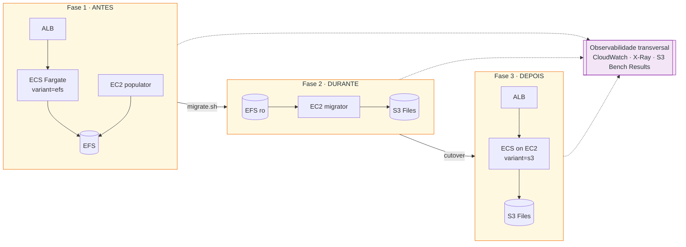
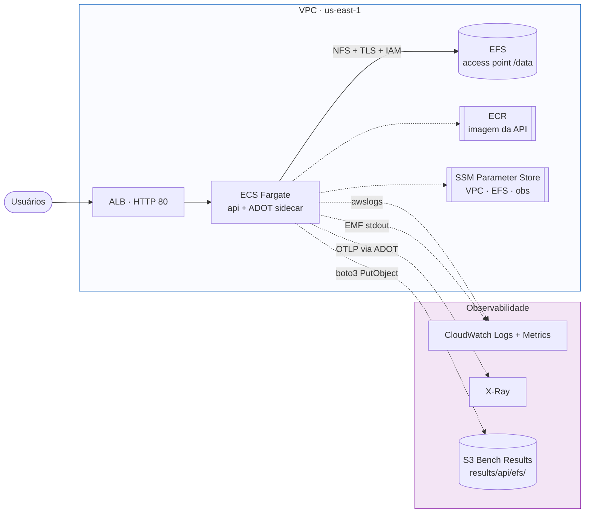
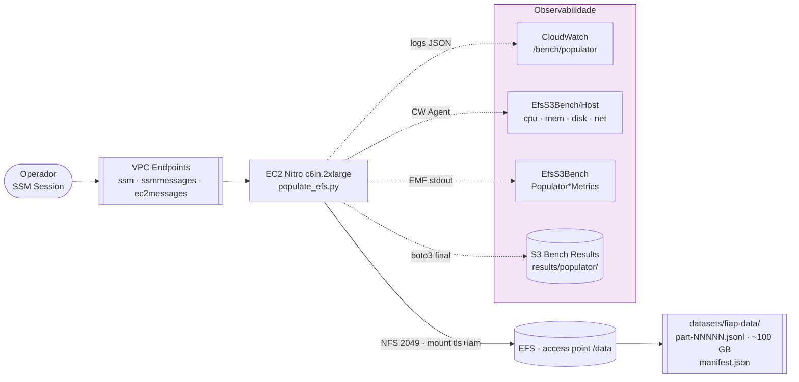
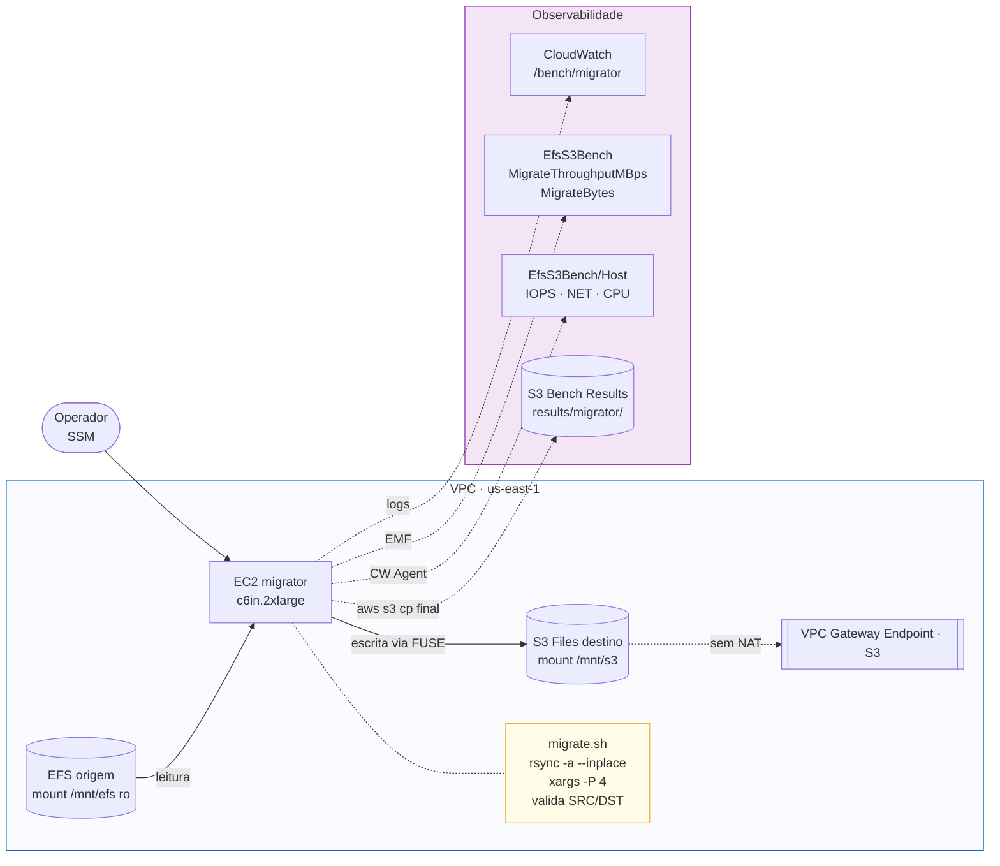
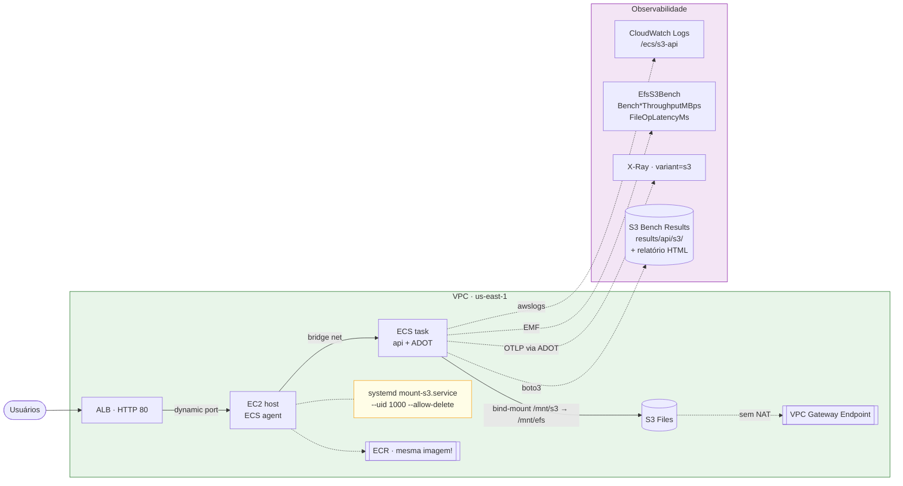

# Arquiteturas · EFS → S3 · 3 Fases

Diagramas em [Mermaid](https://mermaid.js.org/) — renderizam direto no GitHub,
VSCode (extensão Markdown Preview Mermaid) e em qualquer leitor Markdown
moderno.

## 1. Visão geral — jornada em 3 fases

---

## 2. Fase 1 · ECS Fargate + EFS (ANTES)

---

## 3. Fase 1 · Populator (setup de dados)

---

## 4. Fase 2 · Migrator (EFS → S3 via 2 mounts POSIX)

---

## 5. Fase 3 · ECS EC2 + S3 via Mountpoint (DEPOIS)

---

## Legenda

- `[rect]` = serviço / componente AWS
- `[(cilindro)]` = storage (EFS, S3)
- `[[caixa dupla]]` = recurso de infraestrutura (ECR, endpoint, SSM, etc.)
- `([pastilha])` = ator externo (usuário, operador)
- `-->` = fluxo de dados principal (HTTP, NFS, POSIX)
- `-. pontilhado .->` = fluxo de observabilidade ou lateral

Cores:

- **Laranja** (`#FFF8E1`) — fase ANTES (EFS)
- **Verde** (`#E8F5E9`) — fase DEPOIS (S3)
- **Azul claro** (`#FAFBFF`) — VPC
- **Roxo claro** (`#F3E5F5`) — observabilidade
- **Amarelo claro** (`#FFFDE7`) — notas / callouts
